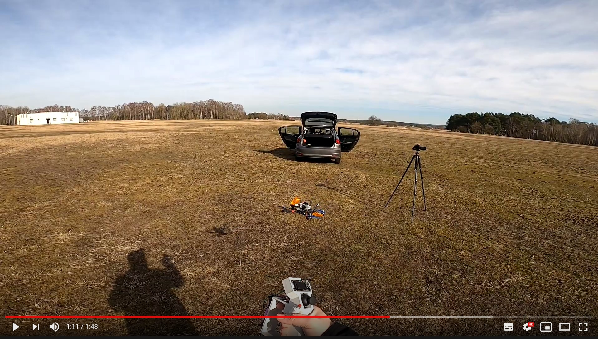
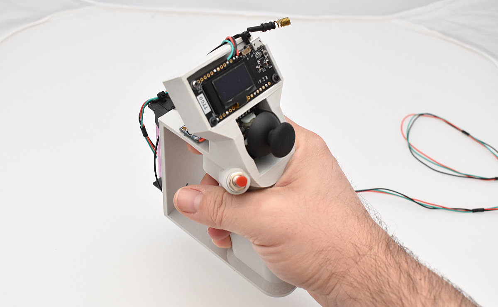
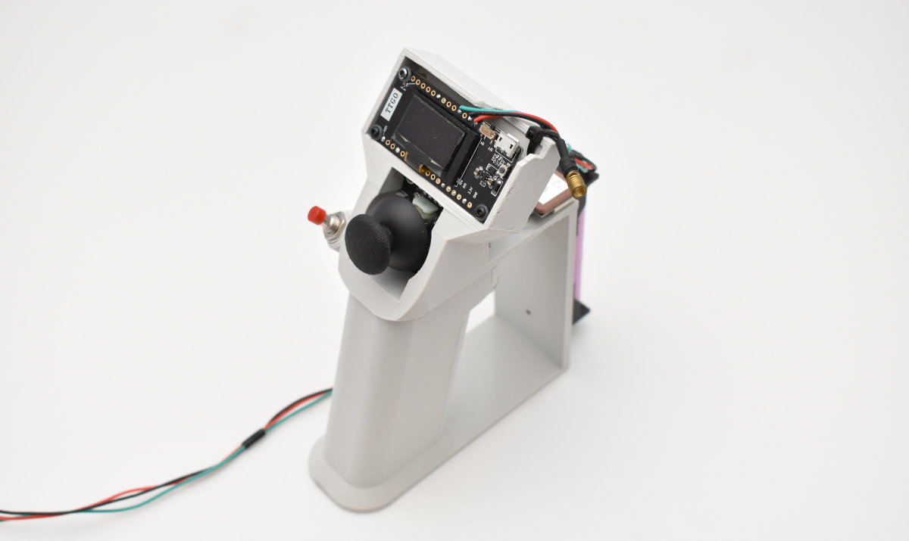
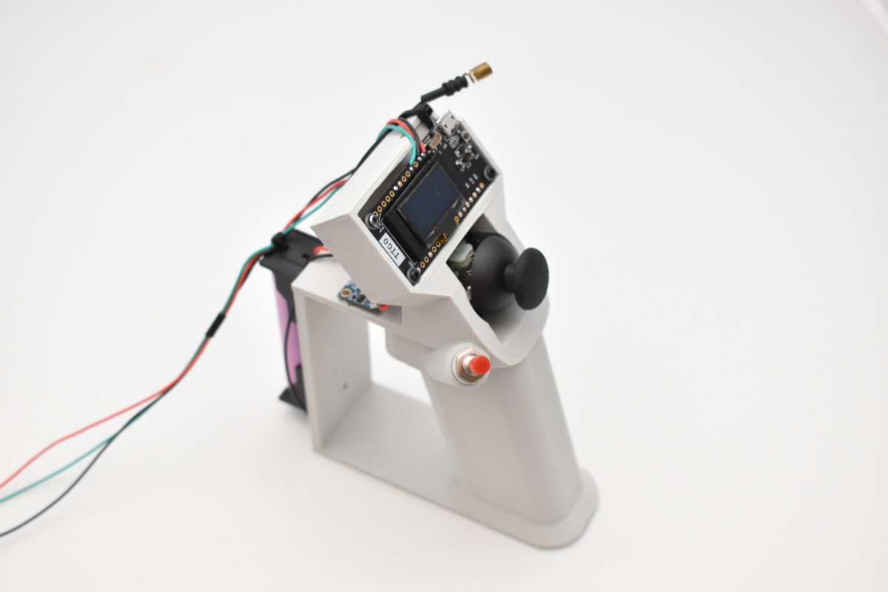

# DiyMotionController

**DIY Motion Controller** is a gesture control controller that works with any drone or RC airplane. It acts as an OpenTX trainer slave connected to the OpenTX radio like a Radiomaster TX16S or any other with SBUS trainer input.

Drone or airplane should be capable of Position Hold and Altitude Hold. INAV or Ardupilot recommended.

# Short manual for OpenTX, Radiomaster TX16S and INAV

## OpenTX setup

1. Configure OpenTX to use Serial Port 1 as a SBUS Trainer (System -> Hardware)
2. Enable Trainer input for your model (Model -> Model Setup -> Trainer Mode Master/Serial)
3. Configure one of the radio switches to enable `Trainer Sticks` (Model -> Special Functions)
4. Connect **DIY Motion Controller** to Serial Port 1. Radio RX pin to ESP32 `SERIAL1_TX` pin (14 default)
5. To enable gesture control, switch configured in point 3 has to be enabled!

## INAV Setup

INAV craft should be capable of performing Position Hold and Altitude Hold. Craft should be stationary when Motion Controller is enabled.

## Motion Controller Setup

### Power Up

1. After powering up, controller should be stationary for gyro to calibrate. Calibration is done when OLED says `Gyro: OK`
1. Joystick should be calibrated by moving the stick to top/down/left/right positions after each power up

### Operations

1. Gesture Control is activated after a long press (1s) of a trigger button. OLED will display `HOT`
1. Enable OpenTX trainer mode with a switch
1. Tilting DIY Motion Controller left and right will roll the craft left and right
1. Tilting DIY Motion Controller forward and back will move the craft forward and back
1. Throttle control is assigned to the thumb joystick UP/DOWN
1. Yaw control is assigned to the thumb joystick LEFT/RIGHT
1. Gesture YAW control is enabled only when THUMB trigger is pressed 

# Parts

* [ESP32 LORA32 V2](http://bit.ly/3vh5kmn) - future wireless version will require 2 boards. Other ESP32 with OLED will do, but you will have to adjust pin mapping
* [MPU6050 gyro board](http://bit.ly/3byWMiU)
* [10mm push button](http://bit.ly/30L4X5P)
* [7mm push button](http://bit.ly/3vh5BWr)
* [Analog joystick](http://bit.ly/2POPZt3) - current 3D printed model supports this kind of joystick. Future version might require different joystick
* [AWG30 wires](http://bit.ly/35KMXc2)
* [Optional 18650 holder](http://bit.ly/3cplTny) - for future wireless version

[STL for the controller available here](http://bit.ly/2OkMKcy). Print with PLA/PET-G/ABS. Design has integrated supports, print without adding supports in 
slicing software.

# Wiring

| ESP32 PIN | Accessory PIN |
|----       |----           |
| 0         | MPU6050 SDA   |
| 23        | MPU6050 SCL   |
| 4         | Thumb trigger |
| 15        | Index finger trigger |
| 13        | Thumb joystick X Axis |
| 33        | Thumb joystick Y Axis |
| 32        | Thumb hoystick press button |

Both Thumb and Index Finger Triggers should be wired to GND (ESP32 Pullups are enabled on those inputs)

# Dependencies

To complile and flash ESP32, you will need the latest Arduino and [Arduino ESP32 core](https://github.com/espressif/arduino-esp32)

Following Arduino libraries are required:

* [Adafruit_MPU6050](https://github.com/adafruit/Adafruit_MPU6050)
* [Adafruit Unified Sensor Driver](https://github.com/adafruit/Adafruit_Sensor)

